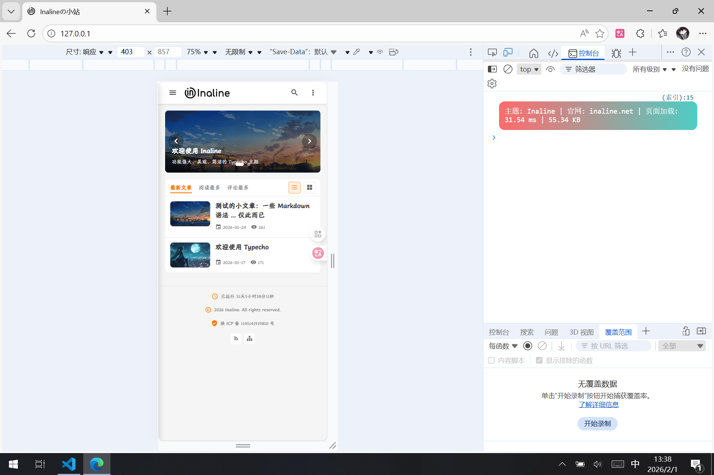

<div align="center">

# Inaline Typecho Theme

### A Powerful, Beautiful, and Concise Typecho Theme

[](https://typecho.org/)
[](../LICENSE)
[](https://gitee.com/inaline/typecho-theme)
[](https://gitee.com/inaline/typecho-theme)

简体中文 | [English](README.en.md)

---

<div align="left">



</div>

---

## ✨ Features

- 🎨 **Modern Design** - Clean and beautiful interface with dark mode support
- 📱 **Responsive Layout** - Perfect for desktop and mobile devices
- 🚀 **High Performance** - Server-side rendering for fast loading
- 🔍 **Built-in Search** - Article search with search history
- 📝 **Markdown Support** - Full Markdown syntax support
- 🧮 **Math Formulas** - KaTeX math formula rendering
- 💬 **Comment System** - Two-level comments with reply functionality
- 🏷️ **Categories & Tags** - Multi-level categories and tag management
- 📊 **Statistics** - Article views, likes, and more
- 🎯 **SEO Optimized** - Built-in SEO optimization
- 🌐 **Multi-language** - Chinese and English interface support

## 📸 Screenshots

### Homepage


### Article Page


### Dark Mode


### Mobile View


## 🚀 Quick Start

### Requirements

- PHP >= 7.4
- Typecho >= 1.2.0
- MySQL >= 5.7
- Apache/Nginx

### Installation

1. **Download Theme**

   ```bash
   git clone https://gitee.com/inaline/typecho-theme.git
   ```

   Or visit [Gitee Releases](https://gitee.com/inaline/typecho-theme/releases) to download the latest version

2. **Install Theme**

   - Upload the `inaline` folder to `/usr/themes/` directory in your Typecho installation
   - Login to Typecho admin panel
   - Go to `Dashboard` -> `Appearance` -> `Enable Theme`

3. **Configure Theme**

   - Go to `Dashboard` -> `Appearance` -> `Theme Settings`
   - Configure theme options as needed

## 📖 Documentation

### Basic Configuration

The theme provides rich configuration options:

- **Site Info** - Site title, description, keywords
- **Appearance Settings** - Logo, cover image, theme colors
- **Feature Toggles** - Search, comments, dark mode, etc.
- **SEO Settings** - Custom SEO tags

### Publishing Articles

Supports the following Markdown syntax:

- Headings, lists, blockquotes, code blocks
- Tables, task lists
- Math formulas (KaTeX)
- Images, links, videos

### Comment System

- Two-level comments support
- Reply functionality
- Comment sorting (newest/oldest)
- Comment pagination

## 🎨 Customization

### Change Theme Colors

Modify CSS variables in `assets/css/style.css`:

```css
:root {
    --primary-color: #FF7900;
    --primary-color-light: #FF9A40;
    --primary-color-dark: #E66A00;
}
```

### Add Custom CSS

Add custom CSS in theme settings, or modify `assets/css/style.css` directly

### Modify Template Files

The theme uses a component-based structure. Main template files:

- `index.php` - Homepage
- `post.php` - Article page
- `archive.php` - Archive page
- `404.php` - 404 page

Component files are located in `core/Components/` directory

## 📦 Project Structure

```
inaline/
├── assets/              # Static resources
│   ├── css/            # Style files
│   ├── js/             # JavaScript files
│   ├── fonts/          # Font files
│   └── images/         # Image resources
├── core/               # Core functionality
│   ├── Components/     # Components
│   ├── Modules/        # Modules
│   └── Widgets/        # Widgets
├── library/            # Library files
├── functions.php       # Theme functions
├── index.php          # Homepage template
├── post.php           # Article page template
├── archive.php        # Archive page template
├── 404.php            # 404 page template
├── config.php         # Configuration file
└── README.md          # Documentation
```

## 🔧 Development

### Local Development

1. Clone the repository

```bash
git clone https://gitee.com/inaline/typecho-theme.git
cd typecho-theme
```

2. Create a symbolic link in your local Typecho installation

```bash
ln -s /path/to/typecho-theme /path/to/typecho/usr/themes/inaline
```

3. Refresh the page after making changes to see the effects

### Contributing

Issues and Pull Requests are welcome!

1. Fork the repository
2. Create a feature branch (`git checkout -b feature/AmazingFeature`)
3. Commit your changes (`git commit -m 'Add some AmazingFeature'`)
4. Push to the branch (`git push origin feature/AmazingFeature`)
5. Open a Pull Request

## 📝 Changelog

### v1.0.0 (2026-02-01)

#### Added
- 🎉 First official release
- ✨ Modern responsive design
- 🌙 Dark mode support
- 🔍 Built-in search functionality
- 💬 Two-level comment system
- 🧮 KaTeX math formula support
- 📊 Article statistics
- 🏷️ Multi-level categories and tags
- 📱 Mobile optimization
- 🎯 SEO optimization

#### Improved
- ⚡ Performance optimization, faster loading
- 🎨 UI/UX improvements
- 🔧 Code structure optimization

#### Fixed
- 🐛 Fixed several known issues

## 🤝 Support

- 📧 Email: Inaline@qq.com
- 💬 QQ: 2291374016
- 🌐 Website: https://inaline.net
- 📦 Gitee: https://gitee.com/inaline/typecho-theme

## 📄 License

This project is licensed under the MIT License.

### License Terms

1. **Copyright Notice** - Keep the copyright and license notice
2. **Attribution Requirement** - Retain a hyperlink to this project in prominent locations such as the website footer
3. **Disclaimer** - The software is provided "as is", without warranty of any kind

### Multimedia Resources Disclaimer

This license applies only to the source code files and documentation of this project. All multimedia resources (including but not limited to images, fonts, audio, video, icons, and other media files) are **NOT** covered by this license.

These multimedia resources may be obtained from various sources on the internet and may be subject to their own respective licenses and copyright restrictions. Users are responsible for ensuring compliance with the applicable licenses for any multimedia resources they use. The authors and copyright holders of this project assume no responsibility or liability for the use of multimedia resources included in or distributed with this project.

For specific licensing information about multimedia resources, please refer to the individual asset documentation or contact the original creators.

For the full license text, please see the [LICENSE](../LICENSE) file.

## 🙏 Acknowledgments

Thanks to the following open source projects:

- [Typecho](https://typecho.org/) - Lightweight blogging system
- [KaTeX](https://katex.org/) - Fast math formula rendering library
- [Material Design Icons](https://materialdesignicons.com/) - Material Design icon library
- [Bootstrap](https://getbootstrap.com/) - CSS framework

## 📮 Feedback

If you have any questions or suggestions, please:

- Submit an [Issue](https://gitee.com/inaline/typecho-theme/issues)
- Send an email to Inaline@qq.com
- Join the QQ group for discussion

---

<div align="center">

**Made with ❤️ by Inaline Studio**

[⬆ Back to Top](#inaline-typecho-theme)

</div>